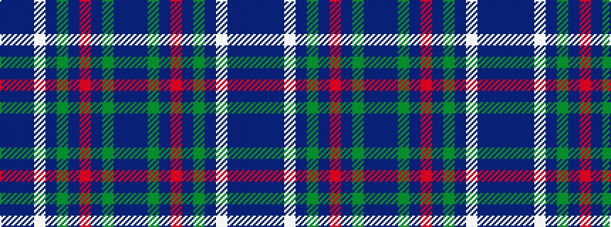

BBBWBGBRBGBB

It is a 12 stripe tartan.

<figure class="pat-woven">

<figcaption>idealised sample</figcaption>
</figure>

## Colour Sequence



## Tartans with this colour sequence

| Tartans |
|---------------|
| [Lyon (Personal)](/variants/s12/db30dt4g5dt2r2dt2g5dt4w10dt5b8dt1~x2/)|
||
