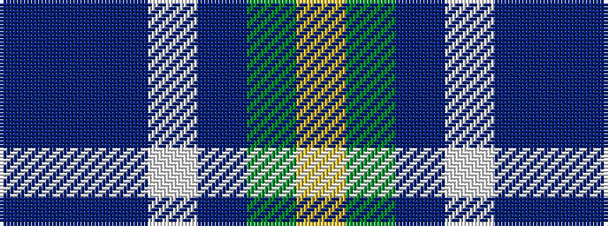

BBBWBGY

It is a 7 stripe tartan.

<figure class="pat-woven">

<figcaption>idealised sample</figcaption>
</figure>

## Colour Sequence



## Tartans with this colour sequence

| Tartans |
|---------------|
| [Rhode Island, State of](/setts/s7/dt4b28dt11w2dt2g14ly2~x2/)|
||
