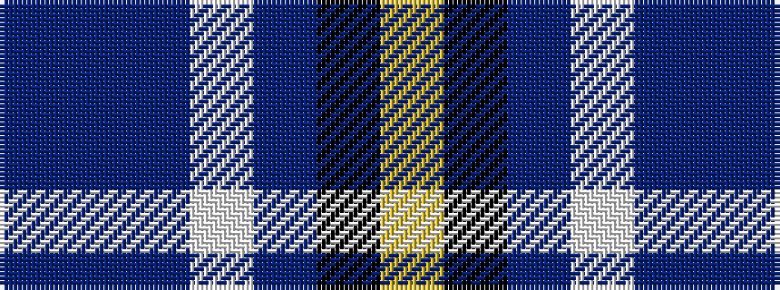

BBBWBKY

It is a 7 stripe tartan.

<figure class="pat-woven">

<figcaption>idealised sample</figcaption>
</figure>

## Colour Sequence



## Tartans with this colour sequence

| Tartans |
|---------------|
| [New York State Troopers](/setts/s7/n6dp4n2w2n25k26ly4~x2/)|
||
