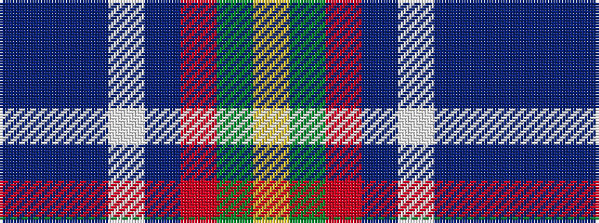

BBBWBRGY

It is a 8 stripe tartan.

<figure class="pat-woven">

<figcaption>idealised sample</figcaption>
</figure>

## Colour Sequence



## Tartans with this colour sequence

| Tartans |
|---------------|
| [State Seal of Iowa (Fashion)](/variants/s8/dt5b43dt18lb4b6r5dy25lo5~x2/)|
||
