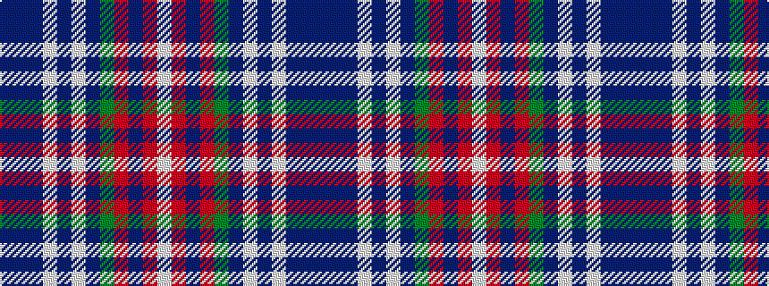

BBBWBWBGRBRW

It is a 12 stripe tartan.

<figure class="pat-woven">

<figcaption>idealised sample</figcaption>
</figure>

## Colour Sequence



## Tartans with this colour sequence

| Tartans |
|---------------|
| [Louth Irish County Tartan](/variants/s12/t38dp4t8w2t4w3t4dg14r7t2r4w2~x2/)|
||
