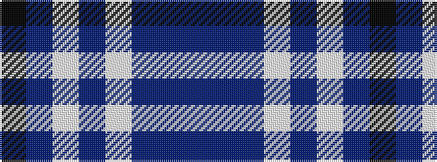

BBBWBWBK

It is a 8 stripe tartan.

<figure class="pat-woven">

<figcaption>idealised sample</figcaption>
</figure>

## Colour Sequence



## Tartans with this colour sequence

| Tartans |
|---------------|
| [Wyckoff, Ann Grainger Phillips Commemorative Tartan](/variants/s8/b70db5b3wi5b3w5b3k5~x2/)|
||
