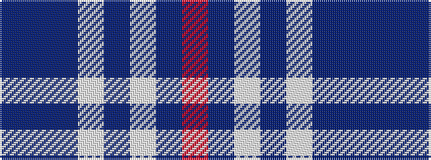

BBBWBWBR

It is a 8 stripe tartan.

<figure class="pat-woven">

<figcaption>idealised sample</figcaption>
</figure>

## Colour Sequence



## Tartans with this colour sequence

| Tartans |
|---------------|
| [Glen Innes (Australia)](/setts/s8/t142db12dbi24w7dbi5w5dbi5r10/)|
||
| [Glen Innes (District)](/setts/s8/dbi142dt12db24w7db5w5db5r10/)|
||
