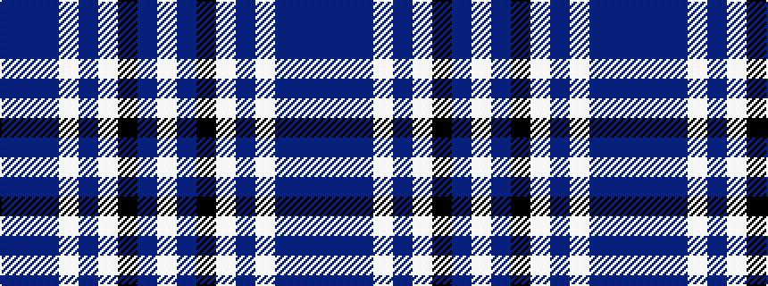

BBBWBWKBW

It is a 9 stripe tartan.

<figure class="pat-woven">

<figcaption>idealised sample</figcaption>
</figure>

## Colour Sequence



## Tartans with this colour sequence

| Tartans |
|---------------|
| [Turnberry Scotland](/variants/s9/n14b3n2lb8n5lb2k2n25w2~x2/)|
||
