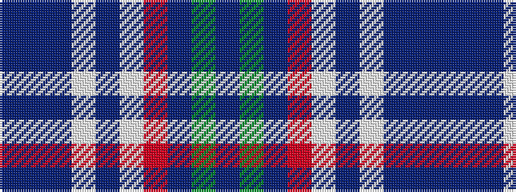

BBBWBWRBGB

It is a 10 stripe tartan.

<figure class="pat-woven">

<figcaption>idealised sample</figcaption>
</figure>

## Colour Sequence



## Tartans with this colour sequence

| Tartans |
|---------------|
| [Bukowski-Jackson (Personal)](/variants/s10/dt30t5dt5lp5dt10w4r4dt10g5dt10~x2/)|
||
