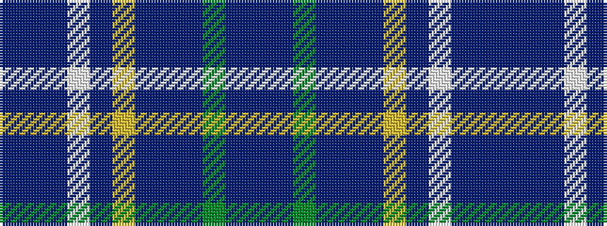

BBBWBYBBBGBB

It is a 12 stripe tartan.

<figure class="pat-woven">

<figcaption>idealised sample</figcaption>
</figure>

## Colour Sequence



## Tartans with this colour sequence

| Tartans |
|---------------|
| [Harmony (Fashion)](/setts/s12/db11ti3db4w3db3lo4db3dbi13t34dg3t4db3~x2/)|
||
