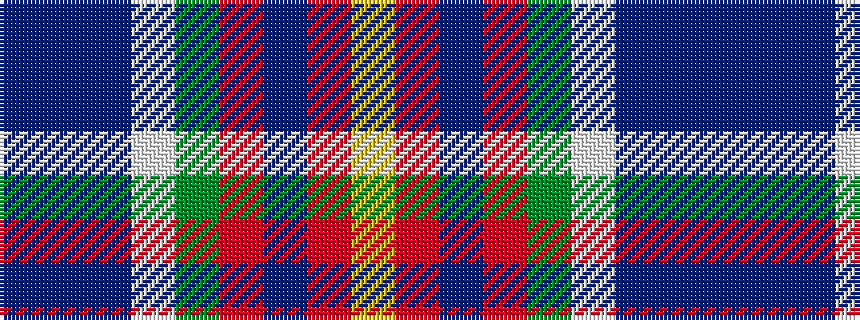

BBBWGRBRY

It is a 9 stripe tartan.

<figure class="pat-woven">

<figcaption>idealised sample</figcaption>
</figure>

## Colour Sequence



## Tartans with this colour sequence

| Tartans |
|---------------|
| [Royal Canadian Mounted Police](/variants/s9/dt76b1dt2lb1g14r5dt13o1lo1~x2/)|
||
