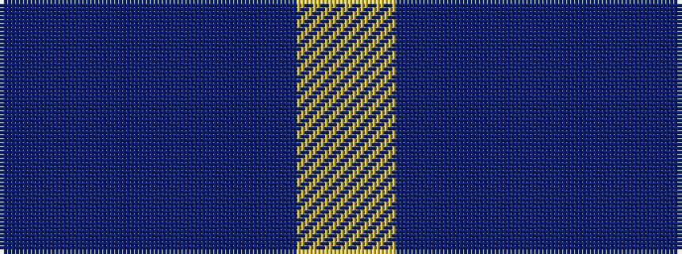

BBBY

It is a 4 stripe tartan.

<figure class="pat-woven">

<figcaption>idealised sample</figcaption>
</figure>

## Colour Sequence



## Tartans with this colour sequence

| Tartans |
|---------------|
| [Peacock](/variants/s4/t20p3db7ly1~x4/)|
||
| [Peacock (Samantha)](/variants/s4/t20dp3db7ly1~x4/)|
||
