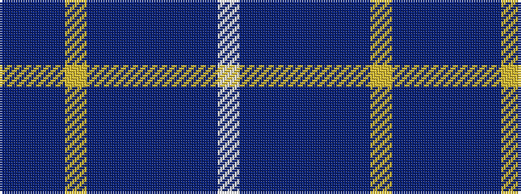

BBBYBBBBBBW

It is a 11 stripe tartan.

<figure class="pat-woven">

<figcaption>idealised sample</figcaption>
</figure>

## Colour Sequence



## Tartans with this colour sequence

| Tartans |
|---------------|
| [Royal Gourock Yacht Club, The](/setts/s11/db2dr5db8ly2dr3dbii9dr2db18dbii9dbi4w2~x2/)|
||
