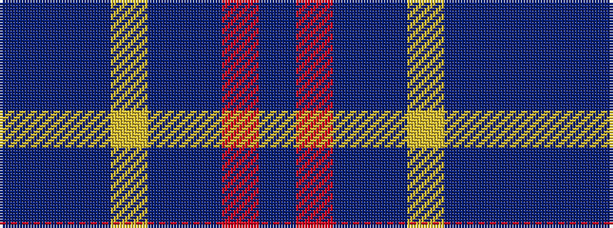

BBBYBBRB

It is a 8 stripe tartan.

<figure class="pat-woven">

<figcaption>idealised sample</figcaption>
</figure>

## Colour Sequence



## Tartans with this colour sequence

| Tartans |
|---------------|
| [Mercer, Charles](/setts/s8/db9b2db2ly1b7db2r1b4~x4/)|
||
