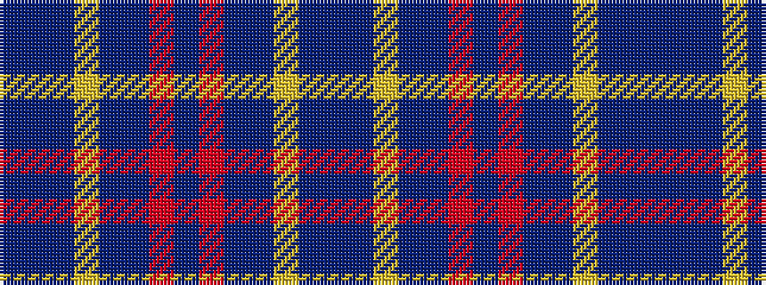

BBBYBBRBRBBYBB

It is a 14 stripe tartan.

<figure class="pat-woven">

<figcaption>idealised sample</figcaption>
</figure>

## Colour Sequence



## Tartans with this colour sequence

| Tartans |
|---------------|
| [Mercer Blue Personal Tartan Tartan Number: 5880. Earliest known date: 2001 Designed by Dr P{hil Smith of TECA for Charles Mercer of Rocky Mount, North Carolina. Can be worn by all of the name. See products available Copyright © Blair Urquhart, Comrie, 2015](/setts/s14/db9b2db2ly1b7db2r1b4~x4/)|
||
