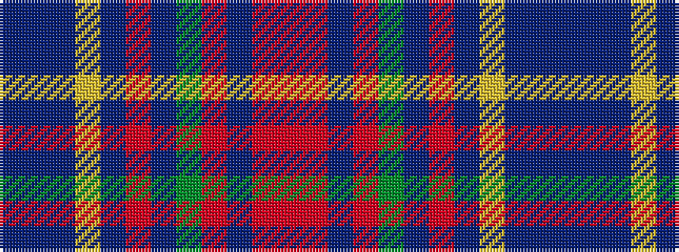

BBBYBRBGRBRR

It is a 12 stripe tartan.

<figure class="pat-woven">

<figcaption>idealised sample</figcaption>
</figure>

## Colour Sequence



## Tartans with this colour sequence

| Tartans |
|---------------|
| [Louth, County](/variants/s12/b48dp4b8lr2b4r3b4dg14ri7b2ri4r2~x2/)|
||
