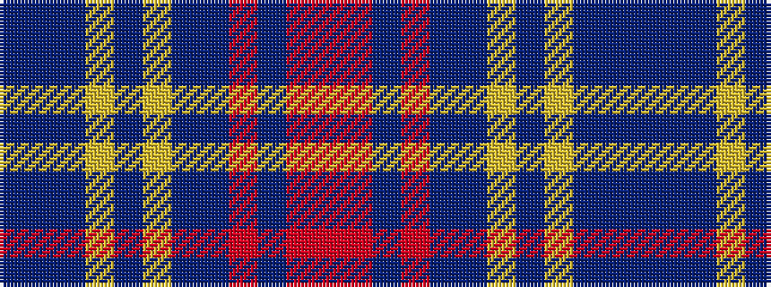

BBBYBYBBRBRR

It is a 12 stripe tartan.

<figure class="pat-woven">

<figcaption>idealised sample</figcaption>
</figure>

## Colour Sequence



## Tartans with this colour sequence

| Tartans |
|---------------|
| [Louth](/setts/s12/n38dp4n8ly2n4lo3n4n14r7n2r4o2~x2/)|
||
