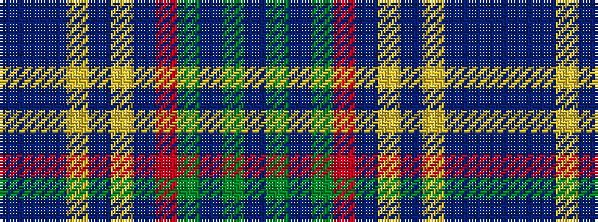

BBBYBYBRGBGB

It is a 12 stripe tartan.

<figure class="pat-woven">

<figcaption>idealised sample</figcaption>
</figure>

## Colour Sequence



## Tartans with this colour sequence

| Tartans |
|---------------|
| [Harmony, 2](/variants/s12/dr9t3dr4ly3dr3ly4dr3o11g30b3g4dr3~x2/)|
||
