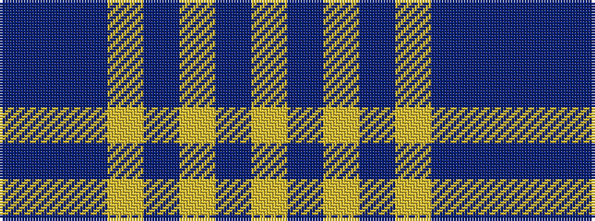

BBBYBYBY

It is a 8 stripe tartan.

<figure class="pat-woven">

<figcaption>idealised sample</figcaption>
</figure>

## Colour Sequence



## Tartans with this colour sequence

| Tartans |
|---------------|
| [Chindecella Gorse (Personal)](/setts/s8/lo7db4lo2db4lo23n19db19n4~x2/)|
||
| [Heil, Rudiger (Personal)](/setts/s8/lo6n2lo2n2lo18n13dt13n2~x2/)|
||
