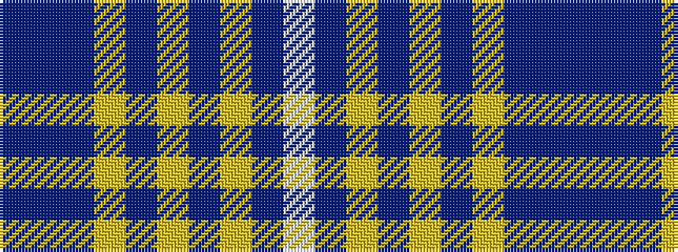

BBBYBYBYBW

It is a 10 stripe tartan.

<figure class="pat-woven">

<figcaption>idealised sample</figcaption>
</figure>

## Colour Sequence



## Tartans with this colour sequence

| Tartans |
|---------------|
| [Intelligent Finance](/setts/s10/n5dp40n5lr5n32lr5n5lr40dp7w5/)|
||
