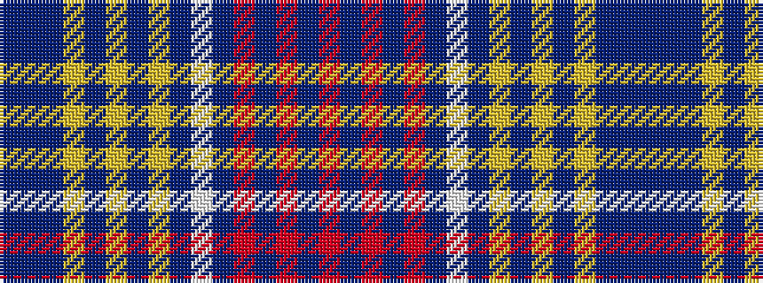

BBBYBYBYBWBRBRBR

It is a 16 stripe tartan.

<figure class="pat-woven">

<figcaption>idealised sample</figcaption>
</figure>

## Colour Sequence



## Tartans with this colour sequence

| Tartans |
|---------------|
| [McBeams Boy](/setts/s16/t19db4t19lo5t2lo19t2lo5t19w2t19r5t2r19t2r5~x2/)|
||
