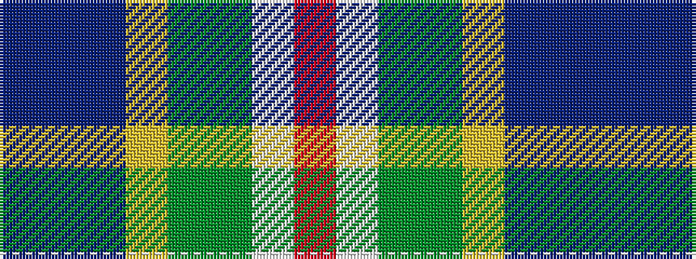

BBBYGGWR

It is a 8 stripe tartan.

<figure class="pat-woven">

<figcaption>idealised sample</figcaption>
</figure>

## Colour Sequence



## Tartans with this colour sequence

| Tartans |
|---------------|
| [Reid (Mill City)](/variants/s8/dbi11db11dbii11lg11g11gi11w3r5~x2/)|
||
