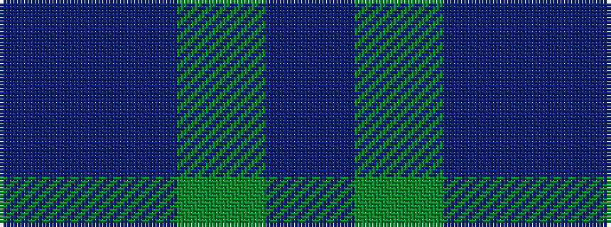

BBGB

It is a 4 stripe tartan.

<figure class="pat-woven">

<figcaption>idealised sample</figcaption>
</figure>

## Colour Sequence



## Tartans with this colour sequence

| Tartans |
|---------------|
| [Sheffield High (School)](/setts/s4/t5dt12g8t4/)|
||
