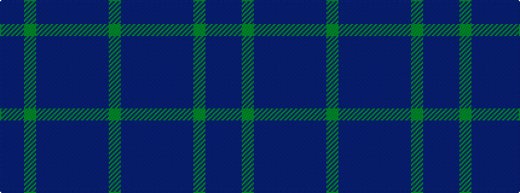

BBGBBBBBBG

It is a 10 stripe tartan.

<figure class="pat-woven">

<figcaption>idealised sample</figcaption>
</figure>

## Colour Sequence



## Tartans with this colour sequence

| Tartans |
|---------------|
| [Wicklow](/variants/s10/dr2db4g12db3dr6t2db24dr2db2g2~x2/)|
||
| [Wicklow, County (District)](/variants/s10/do1n2g6n1do3t1n12do1n1g1~x4/)|
||
