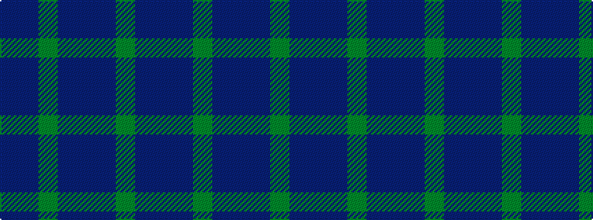

BBGBBBG

It is a [7 stripe pattern](/stripes/stripes7/) — every 7-stripe pattern is gathered there.

<figure class="pat-woven">

<figcaption>idealised sample</figcaption>
</figure>

## Colour Sequence



## Tartans with this colour sequence

This pattern is a design lineage: every tartan below shares one colour order, whatever its owner —
near-identical designs are grouped, the largest lineage first (#112: the pattern is a tartan's
second parent, beside its family or clan).

<table class="sett-table">
<tbody>
<tr><td><a href="/tartans/g/gl/glasgow-4/">Glasgow</a></td></tr>
<tr><td class="sett-swatch"></td></tr>
<tr class="cluster-sep"><td></td></tr>
<tr><td><a href="/tartans/g/gl/glasgow-rock-and-wheel/">Glasgow, Rock and Wheel</a> <small class="dt">ΔTartan 3.25</small></td></tr>
<tr><td class="sett-swatch"></td></tr>
<tr class="cluster-sep"><td></td></tr>
<tr><td><a href="/tartans/m/ma/madder/">Madder</a> <small class="dt">ΔTartan 12.45</small></td></tr>
<tr><td class="sett-swatch"></td></tr>
</tbody>
</table>

