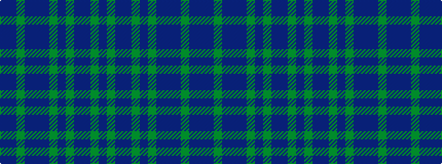

BBGBBBGBGBBGB

It is a 13 stripe tartan.

<figure class="pat-woven">

<figcaption>idealised sample</figcaption>
</figure>

## Colour Sequence



## Tartans with this colour sequence

| Tartans |
|---------------|
| [McCarthy](/variants/s13/dt5g1dt3dp2g10dt3g4dt28dp2dt2g1dt4dp1~x2/)|
||
