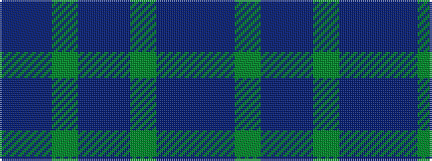

BBGBBGBB

It is a 8 stripe tartan.

<figure class="pat-woven">

<figcaption>idealised sample</figcaption>
</figure>

## Colour Sequence



## Tartans with this colour sequence

| Tartans |
|---------------|
| [Royal Conservatoire of Scotland](/setts/s8/dp11t90dy3t11dp7dy11dp13t11/)|
||
