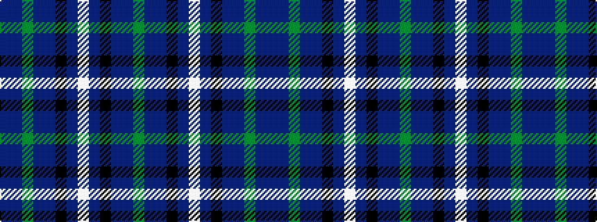

BBGBBKBWBKBBG

It is a 13 stripe tartan.

<figure class="pat-woven">

<figcaption>idealised sample</figcaption>
</figure>

## Colour Sequence



## Tartans with this colour sequence

| Tartans |
|---------------|
| [Heart of Scotland (Fashion)](/setts/s13/dpi17dp3g3dp3dpi4k18db17w4db17k18dpi18dp3g3~x2/)|
||
