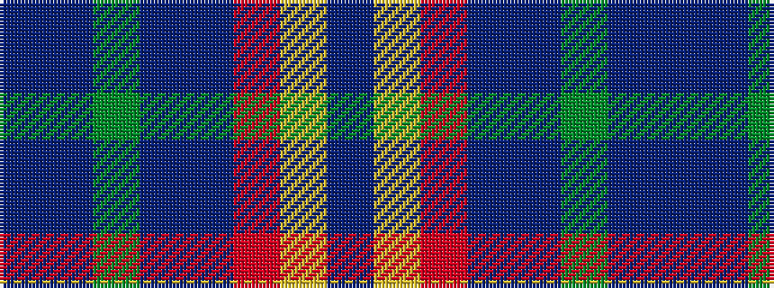

BBGBBRYB

It is a 8 stripe tartan.

<figure class="pat-woven">

<figcaption>idealised sample</figcaption>
</figure>

## Colour Sequence



## Tartans with this colour sequence

| Tartans |
|---------------|
| [Young](/variants/s8/db3t3g30db25dp4r3ly2dp1~x2/)|
||
