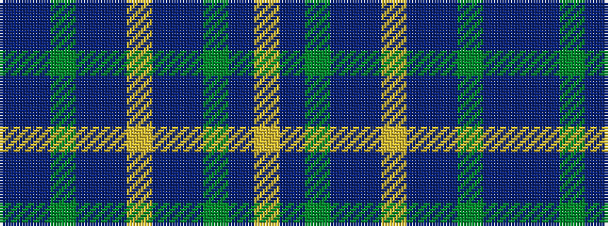

BBGBBYBBGBY

It is a 11 stripe tartan.

<figure class="pat-woven">

<figcaption>idealised sample</figcaption>
</figure>

## Colour Sequence



## Tartans with this colour sequence

| Tartans |
|---------------|
| [Cian of Ely](/variants/s11/b38db4y4b19db8ly18p8b18y4db4lo4~x2/)|
||
| [Cian of Ely (Clan)](/variants/s11/b19db1y1b10db4ly9p4b9y1db1lo2~x4/)|
||
