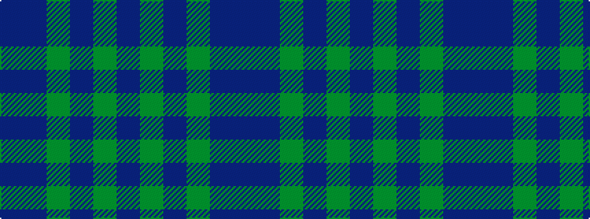

BBGBGB

It is a 6 stripe tartan.

<figure class="pat-woven">

<figcaption>idealised sample</figcaption>
</figure>

## Colour Sequence



## Tartans with this colour sequence

| Tartans |
|---------------|
| [Sheffield High School](/variants/s6/dt12g8t4g8dt12t5/)|
||
