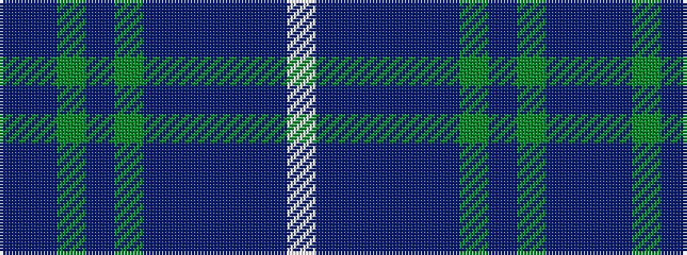

BBGBGBBBBBW

It is a 11 stripe tartan.

<figure class="pat-woven">

<figcaption>idealised sample</figcaption>
</figure>

## Colour Sequence



## Tartans with this colour sequence

| Tartans |
|---------------|
| [Schiehallion (Corporate)](/setts/s11/b14db4g2db2gi3db2b17db31b1db1w2~x2/)|
||
