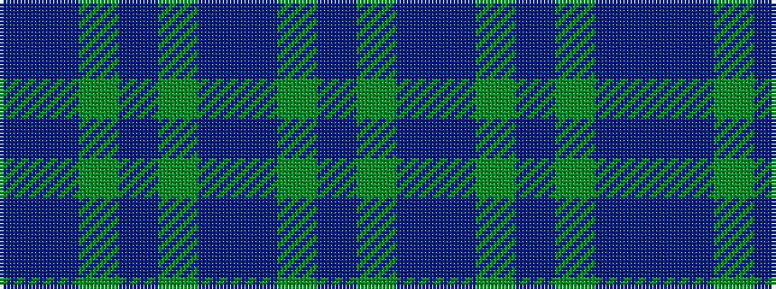

BBGBGBBGB

It is a 9 stripe tartan.

<figure class="pat-woven">

<figcaption>idealised sample</figcaption>
</figure>

## Colour Sequence



## Tartans with this colour sequence

| Tartans |
|---------------|
| [Spirit of Alba (Fashion)](/variants/s9/t4dbi19g1db2g2db18dp24g1dbi2~x2/)|
||
