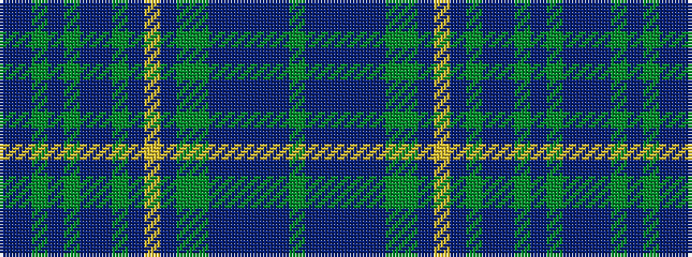

BBGBGBBGBYBGGBBBBBG

It is a 19 stripe tartan.

<figure class="pat-woven">

<figcaption>idealised sample</figcaption>
</figure>

## Colour Sequence



## Tartans with this colour sequence

| Tartans |
|---------------|
| [O'Connor, Hugh (Personal)](/setts/s19/dg12dp1db2dp1db2dp1dg12g2dp12ly1dp12g2db12dp1dg2dp1dg2dp1db12~x2/)|
||
