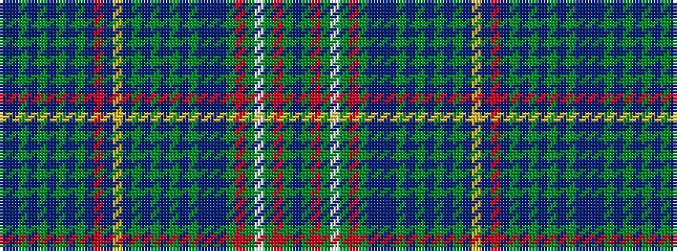

BBGBGBGBGBRBYBGBGBGBGBBBGRGWGRGB

It is a 32 stripe tartan.

<figure class="pat-woven">

<figcaption>idealised sample</figcaption>
</figure>

## Colour Sequence



## Tartans with this colour sequence

| Tartans |
|---------------|
| [Franconian](/setts/s32/db22g7r5g4w5g4r5g5db22b5db4g4db4g22db4g4db4g4db22ly5db5r5db22g4db4g4db4g22db4g4db4b5~x2/)|
||
