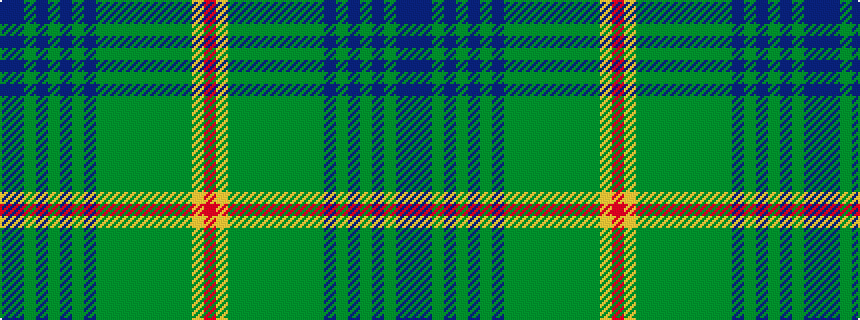

BBGBGBGBGGGGGGGGYR

It is a 18 stripe tartan.

<figure class="pat-woven">

<figcaption>idealised sample</figcaption>
</figure>

## Colour Sequence



## Tartans with this colour sequence

| Tartans |
|---------------|
| [Norwegian Night (Fashion)](/variants/s18/n2dt9y1dt4y2dt2y4n1y15g1y3g3y2g4y1g7ly1r2~x2/)|
||
