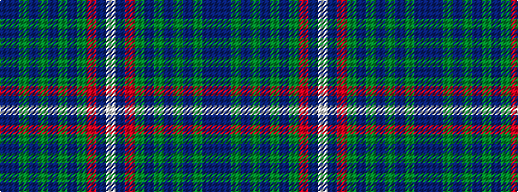

BBGBGBGBGRBW

It is a 12 stripe tartan.

<figure class="pat-woven">

<figcaption>idealised sample</figcaption>
</figure>

## Colour Sequence



## Tartans with this colour sequence

| Tartans |
|---------------|
| [Ayre Robinson (Personal)](/variants/s12/db12b2dg10db16dg6db2dg2db2dg6m2db5w2~x2/)|
||
