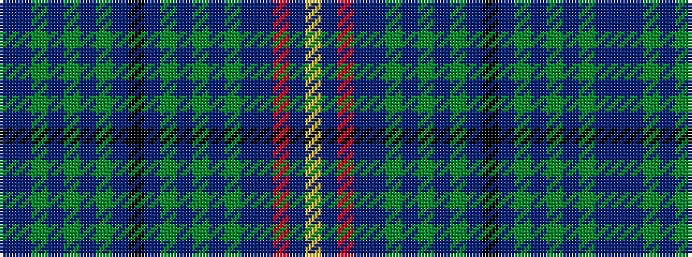

BBGBGBGBKBGBGBGBBRBY

It is a 20 stripe tartan.

<figure class="pat-woven">

<figcaption>idealised sample</figcaption>
</figure>

## Colour Sequence



## Tartans with this colour sequence

| Tartans |
|---------------|
| [Michie (Name)](/variants/s20/n9dp10dg4dp3dg2dp7dg4dp20k2dp20dg4dp7dg2dp3dg4dp10n9r1n2lo1~x2/)|
||
