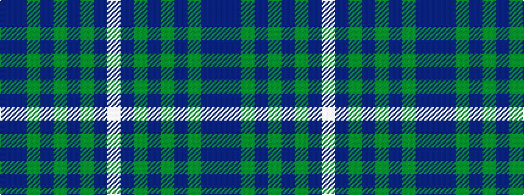

BBGBGBGBW

It is a 9 stripe tartan.

<figure class="pat-woven">

<figcaption>idealised sample</figcaption>
</figure>

## Colour Sequence



## Tartans with this colour sequence

| Tartans |
|---------------|
| [Tamer of Wolves](/variants/s9/w9db2dy8n6dy9n15dy13n3db4~x2/)|
||
