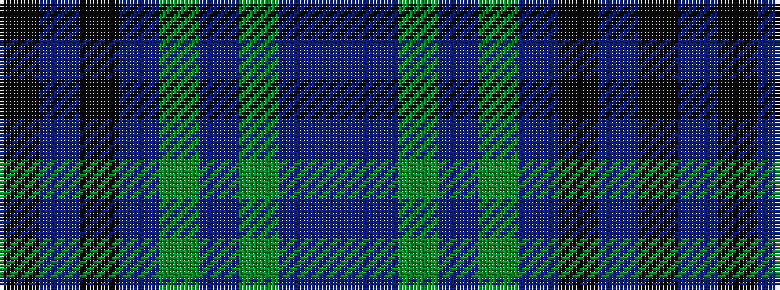

BBGBGBKBK

It is a 9 stripe tartan.

<figure class="pat-woven">

<figcaption>idealised sample</figcaption>
</figure>

## Colour Sequence



## Tartans with this colour sequence

| Tartans |
|---------------|
| [Orman (Midlothian) (Personal)](/setts/s9/k10db3k3db32dg1db1dg1db2n2~x2/)|
||
