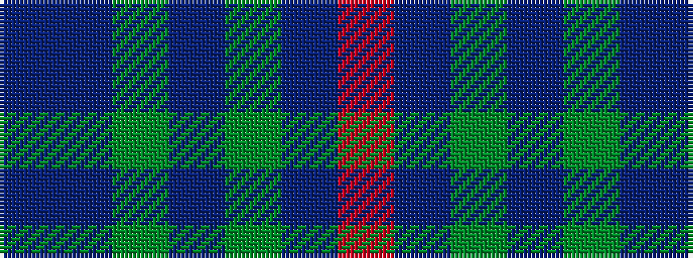

BBGBGBR

It is a 7 stripe tartan.

<figure class="pat-woven">

<figcaption>idealised sample</figcaption>
</figure>

## Colour Sequence



## Tartans with this colour sequence

| Tartans |
|---------------|
| [Komissarov, Dmitry (Personal)](/setts/s7/dp30db30y4db4y4db5r6~x2/)|
||
