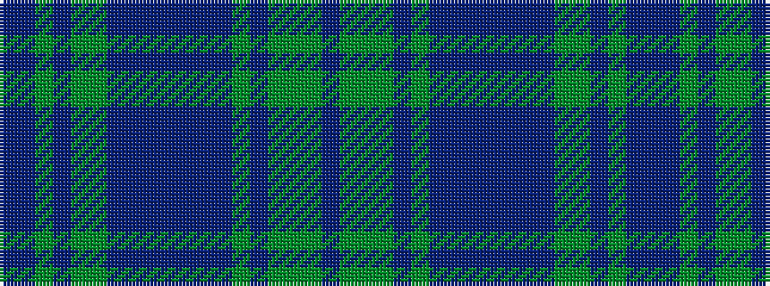

BBGBGGBBBBBBBGBGGGB

It is a 19 stripe tartan.

<figure class="pat-woven">

<figcaption>idealised sample</figcaption>
</figure>

## Colour Sequence



## Tartans with this colour sequence

| Tartans |
|---------------|
| [Watkins (Welsh Name)](/setts/s19/db2b2g5b4g10g15b10db12b6db4b6db12b10g18b2g2g18g1db2/)|
||
