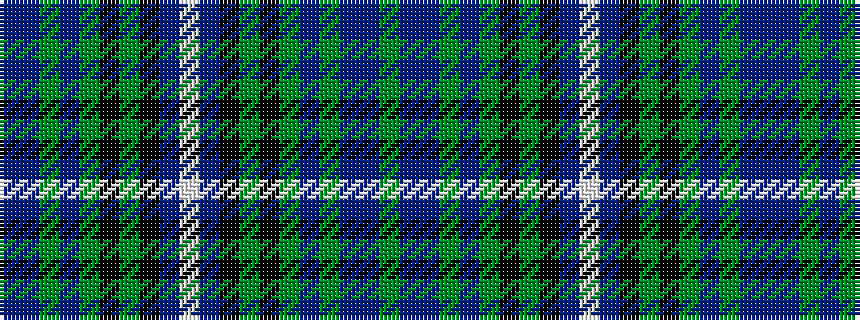

BBGBGKGKBWBKGKGBGBBG

It is a 20 stripe tartan.

<figure class="pat-woven">

<figcaption>idealised sample</figcaption>
</figure>

## Colour Sequence



## Tartans with this colour sequence

| Tartans |
|---------------|
| [Scottish Pride](/variants/s20/g6dpi2dp2g2dp15g3k2g1k15db43w2db43k15g1k2g2dp15g3dp2dpi2~x2/)|
||
