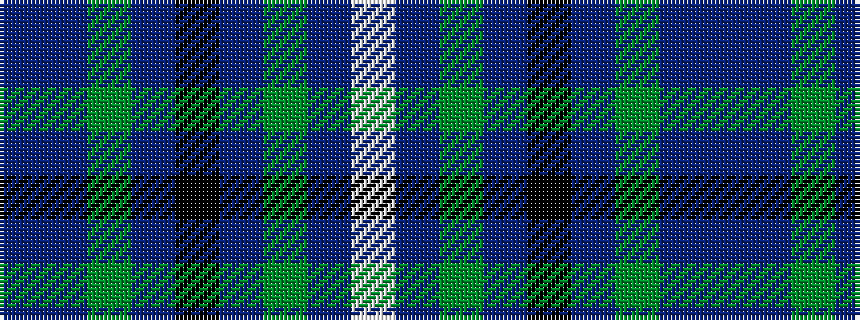

BBGBKBGBW

It is a 9 stripe tartan.

<figure class="pat-woven">

<figcaption>idealised sample</figcaption>
</figure>

## Colour Sequence



## Tartans with this colour sequence

| Tartans |
|---------------|
| [Duchess of York Family Tartan Tartan Number: 607. Earliest known date: 1941 Found in sample books. See products available Copyright © Blair Urquhart, Comrie, 2015](/setts/s9/db1dr9g5dr1k5dr1g5dr9w1~x2/)|
||
