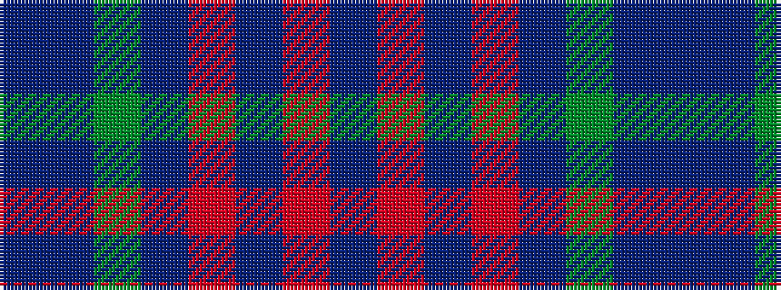

BBGBRBRB

It is a 8 stripe tartan.

<figure class="pat-woven">

<figcaption>idealised sample</figcaption>
</figure>

## Colour Sequence



## Tartans with this colour sequence

| Tartans |
|---------------|
| [Unidentified #61](/setts/s8/db3db1g5db3r9db1r1db2~x4/)|
||
