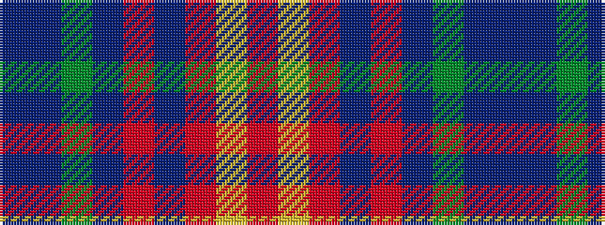

BBGBRBRYR

It is a 9 stripe tartan.

<figure class="pat-woven">

<figcaption>idealised sample</figcaption>
</figure>

## Colour Sequence



## Tartans with this colour sequence

| Tartans |
|---------------|
| [Loch Lomond](/variants/s9/r28ly3r3dt3r4dp8dg10p15dp4~x2/)|
||
| [Loch Lomond (1999)](/variants/s9/r28ly3r3db3r4dp8g10dpi15dp4~x2/)|
||
