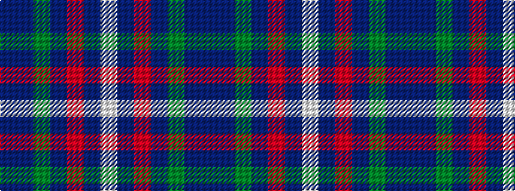

BBGBRBW

It is a 7 stripe tartan.

<figure class="pat-woven">

<figcaption>idealised sample</figcaption>
</figure>

## Colour Sequence



## Tartans with this colour sequence

| Tartans |
|---------------|
| [Woodcock (2014)](/variants/s7/db30dp9dg6dp9r4db17w5~x2/)|
||
| [Woodcock (2014)](/variants/s7/db30dp9g6dp9r4db17w5~x2/)|
||
