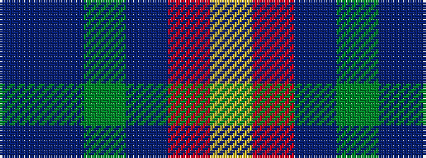

BBGBRY

It is a 6 stripe tartan.

<figure class="pat-woven">

<figcaption>idealised sample</figcaption>
</figure>

## Colour Sequence



## Tartans with this colour sequence

| Tartans |
|---------------|
| [Wright , Anne (Personal)](/setts/s6/db12t6g30db9r8ly1~x2/)|
||
| [Wright, Anne (Personal)](/setts/s6/db12t6g30db9r8lo1~x2/)|
||
