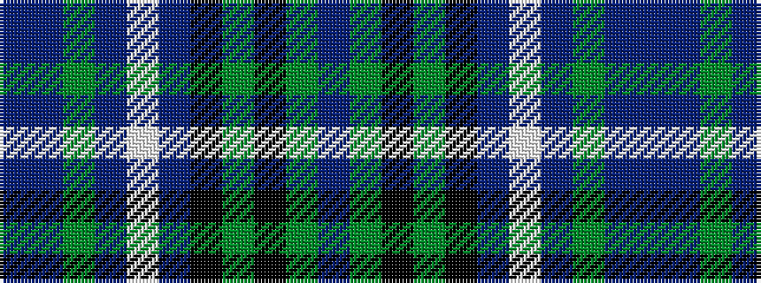

BBGBWBKGKGB

It is a 11 stripe tartan.

<figure class="pat-woven">

<figcaption>idealised sample</figcaption>
</figure>

## Colour Sequence



## Tartans with this colour sequence

| Tartans |
|---------------|
| [Smithers](/variants/s11/p3db13y2db4w2db8k13g10k2g8p3~x2/)|
||
