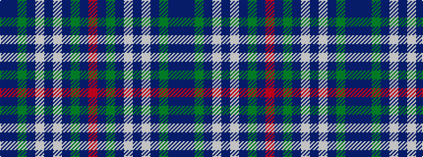

BBGBWBWBGBR

It is a 11 stripe tartan.

<figure class="pat-woven">

<figcaption>idealised sample</figcaption>
</figure>

## Colour Sequence



## Tartans with this colour sequence

| Tartans |
|---------------|
| [Fraser Hunting Dress](/variants/s11/r4do15g11do3lb11do3lb11do3g11do15b4~x2/)|
||
